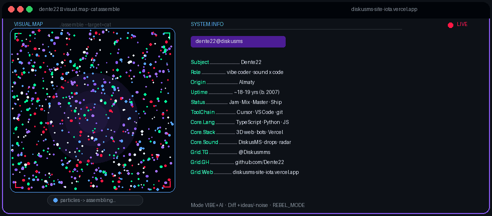
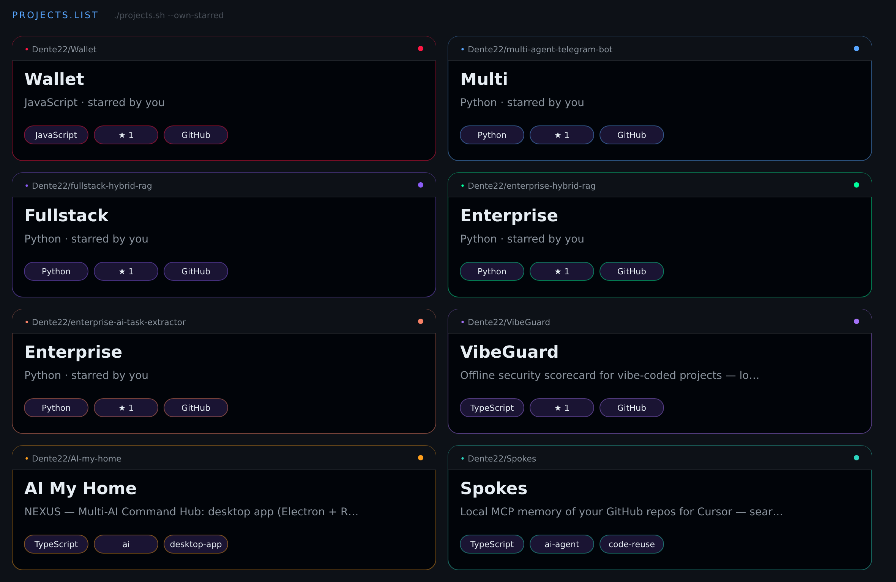

<!--
  Dente22 profile — cyber / neon layout (stats + visual.map + projects)
  Tips for GitHub:
  - Prefer PNG/GIF for local cards
  - Official github-readme-stats.vercel.app is often paused (503)
  - Use community mirror: github-readme-stats.shion.dev
-->

<!-- ===== HERO: particles assemble into cat + SYSTEM.INFO ===== -->

  

 

<!-- ===== CTA ===== -->

 

<!-- ===== STREAK ===== -->

 

<!-- ===== STATS + LANGUAGES ===== -->

 

<!-- ===== CONTRIBUTION SNAKE ===== -->

<picture>
  <source media="(prefers-color-scheme: dark)" srcset="https://raw.githubusercontent.com/Dente22/Dente22/output/github-contribution-grid-snake-dark.svg" />
  <source media="(prefers-color-scheme: light)" srcset="https://raw.githubusercontent.com/Dente22/Dente22/output/github-contribution-grid-snake.svg" />
  
</picture>

 

<!-- ===== PROJECTS ===== -->

  

 

---

<b>🇺🇸 English</b>

 

> I don't "ask AI to code for me".  
> I **jam** with Cursor — taste stays human, speed goes AI.

**Flow:** `Sketch → Jam → Mix → Master → Ship`

| Project | What |
|--------:|:-----|
| [DiskusMS](https://diskusms-site-iota.vercel.app) | portfolio · 3D · rock×hacker |
| [diskusms-music](https://github.com/Dente22/diskusms-music) | tracks + covers as source of truth |
| [WithYou bot](https://github.com/Dente22/WithYou_bot_public) | Telegram · Python |

<b>🇷🇺 Русский</b>

 

> Я не «прошу AI написать за меня».  
> Я **джемлю** с Cursor — вкус человеческий, скорость AI.

**Поток:** `Sketch → Jam → Mix → Master → Ship`

| Проект | Что |
|-------:|:----|
| [DiskusMS](https://diskusms-site-iota.vercel.app) | портфолио · 3D · rock×hacker |
| [diskusms-music](https://github.com/Dente22/diskusms-music) | треки + обложки как источник правды |
| [WithYou bot](https://github.com/Dente22/WithYou_bot_public) | Telegram · Python |

---

`REBEL_MODE // VIBE_ONLINE // NO_MASTER`

